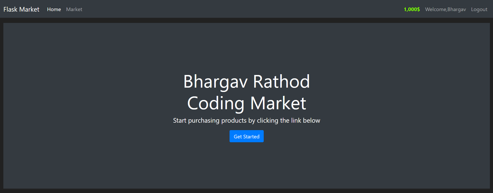
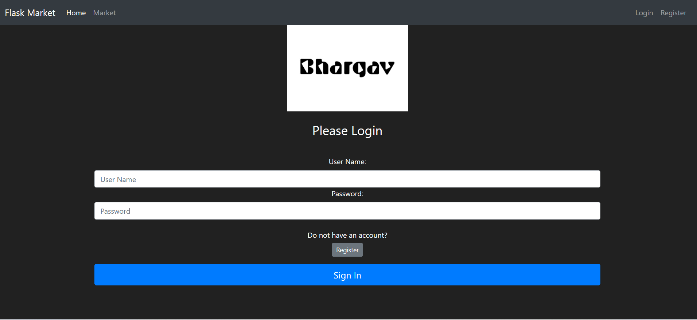
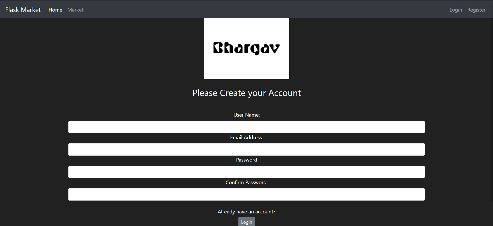
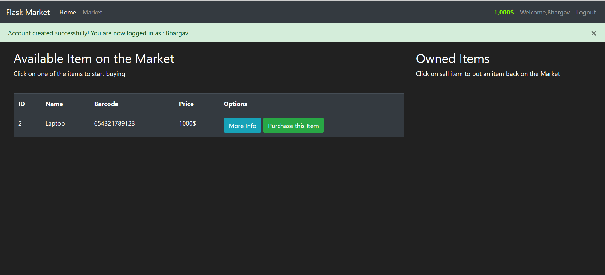

# FlaskMarket - Online Marketplace Application


FlaskMarket is a lightweight online marketplace application built with Flask that allows users to buy and sell items. The application includes user authentication, item listings, and purchase functionality.

Live Demo: [Coming Soon]

## Features

-  User authentication (Register/Login)
-  Browse marketplace items
-  Create new item listings
-  Purchase items from other users
-  Virtual wallet system
-  Responsive Bootstrap design
-  Search functionality

## Tech Stack

**Backend:**
- Python 3
- Flask
- Flask-WTF (Forms)
- Flask-Login (Authentication)
- Flask-SQLAlchemy (Database)

**Frontend:**
- Bootstrap 5
- Jinja2 Templating
- HTML/CSS

**Database:**
- SQLite (Development)

## Installation

1. Clone the repository:
```bash
git clone https://github.com/rbsinh/FlaskMarket.git
cd FlaskMarket

2. Create virtual environment:

```bash

python3 -m venv venv

```

3. Activate virtual environment:

- On Linux/Mac:

```bash

source venv/bin/activate

```

- On Windows:

```bash

venv\Scripts\activate

```
## Running the Application

To run the application in development mode with auto-reload (which restarts the server when code changes are detected), use the following command:

```bash

python run.py --reload

```

The application will be accessible at [http://127.0.0.1:5000/](http://127.0.0.1:5000/).

## Screenshots

| Home Page | Login |

|-----------|-------------|

|  |  |

| Register | Market Place |

|--------------|---------------|

|  |  |